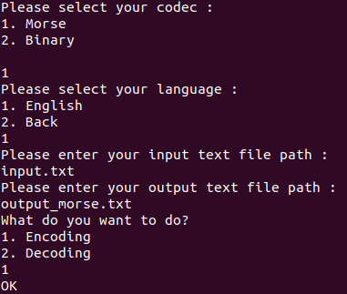

# Python Decode and Encode Text
With this project, you can encode or decode your text with Morse or Binary or ... .

You can easily add your own different encryption rules and languages.

## Add Encryption Rules
1. Create a folder in lib directory.
2. Create empty ```__init__.py``` file.
3. Add python files for your languages.

### Language Files
There must be three variables in the language file.
1. space_words : For space between words
2. space_chars : For space between characters
3. codes : For encryption rules

## Installation
The software does not require any prerequisites.Just clone codes and run it.
```bash
python3 main.py
```
### Screenshot
